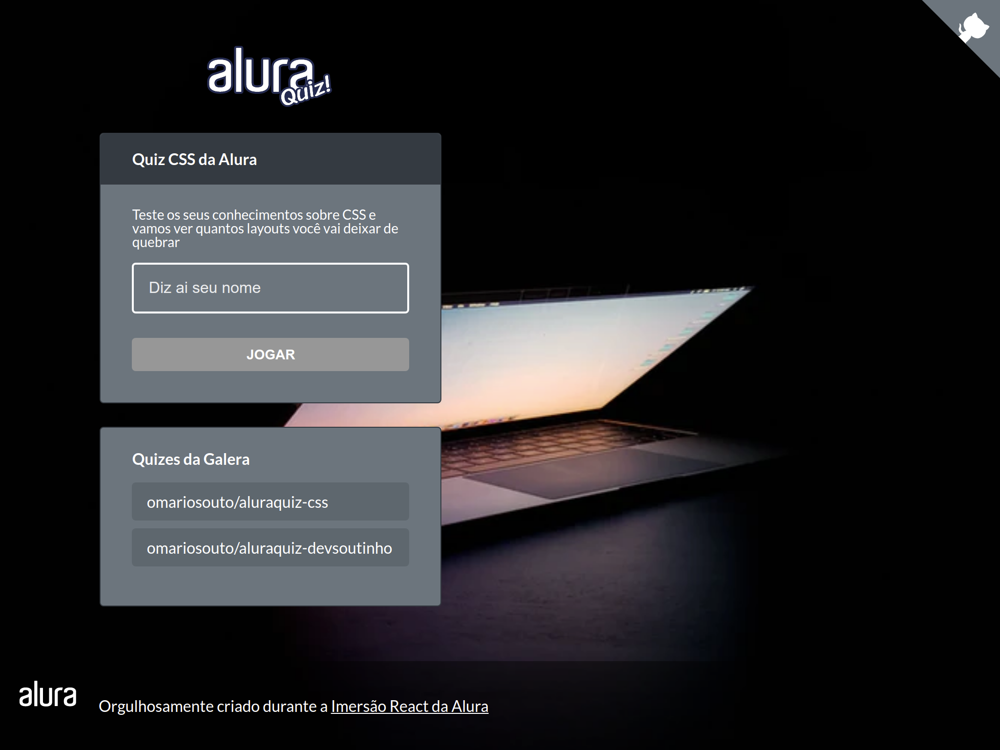

# Imersão React/NextJS Alura

**Código da Imersão React/NextJS promovido pela [Alura](https://github.com/alura-cursos).**




## Onde está o Layout base?
- [Link](https://www.figma.com/file/cg1MIzSRRss8ggpypQbmdD/AluraQuiz?node-id=0%3A1)

## Como rodar ?

```bash
npx run dev
# or
yarn run dev
```

## Tecnologias

[React](https://pt-br.reactjs.org/)

[NextJS](https://nextjs.org/)

[Vercel](https://vercel.com)


[](https://github.com/brunnosena/imersao-react-next-alura/blob/master/LICENSE)
<!-- ALL-CONTRIBUTORS-BADGE:START - Do not remove or modify this section -->